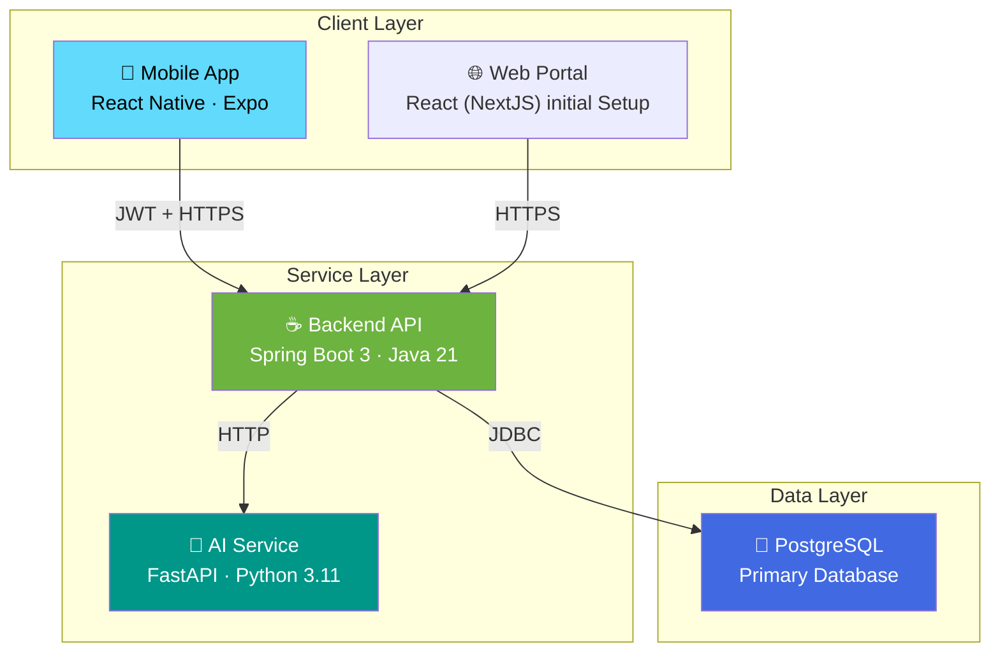
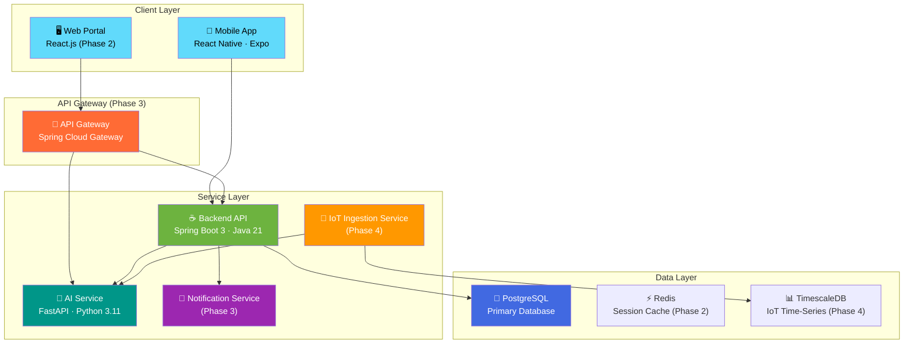
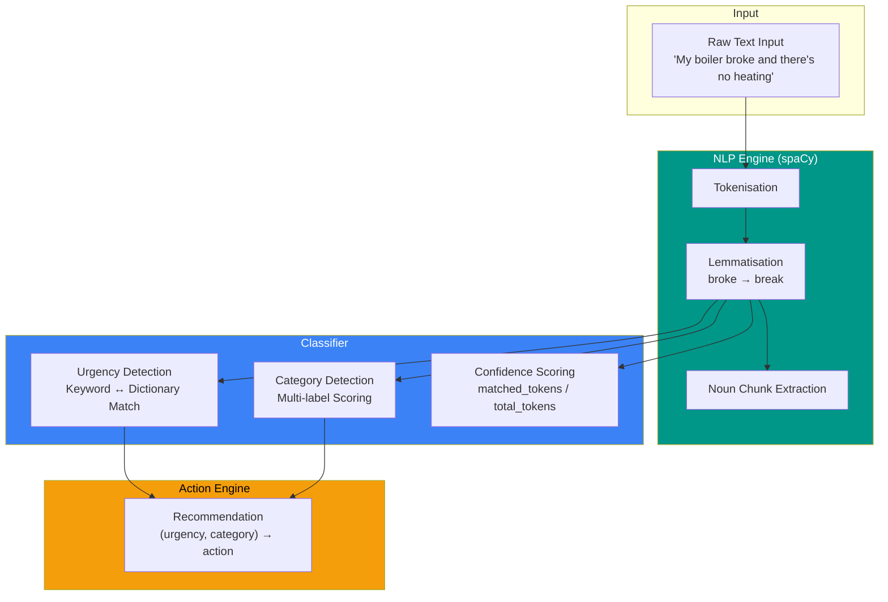

<div align="center">

# 🏠 NEXUS

**Intelligent Property Management Platform**

A full-stack platform I designed and built from the ground up — combining a mobile app,
AI-driven ticket classification, and a modular monolith backend — to demonstrate
how digital innovation can transform social housing operations.

[](https://spring.io/projects/spring-boot)
[](https://fastapi.tiangolo.com)
[](https://expo.dev)
[](https://python.org)
[](https://openjdk.org)
[](https://postgresql.org)

</div>

---

## 🎬 Live Demo

| Resource | Link |
|----------|------|
| � Mobile Demo Video | *Coming soon* |
| 📘 Architecture Diagram | [docs/architecture.md](docs/architecture.md) |
| 🔗 API Documentation | [backend/README.md](backend/README.md) |
| 🤖 AI Pipeline Docs | [ai-service/README.md](ai-service/README.md) |

---

## �📋 Overview

Nexus is a proof-of-concept platform I **designed, architected, and developed independently** to showcase how modern software engineering can solve real problems in social housing — specifically the challenges outlined in the NUCHA KTP programme brief. This MVP demonstrates:

- **AI/NLP-powered ticket classification** — tenants describe issues in plain English; the system auto-classifies urgency, category, and recommends actions
- **Secure JWT authentication** with BCrypt password hashing and biometric unlock
- **Real-time repair tracking** — tenants view, create, and monitor maintenance tickets
- **Modular monolith architecture** — domain-based package structure (auth, tenant, ticket) with enforced service-layer boundaries, designed for future microservice extraction
- **Web staff portal** — planned React.js dashboard for staff and contractor management

> **Why I built this:** To demonstrate my ability to lead a project end-to-end — from system architecture and technology selection through to working code — while solving a real-world problem: reducing arrears, preventing housing-related illness, and giving tenants inclusive, intelligent access to modern housing services.

---

## 📖 Documentation

| Document | Description |
|----------|-------------|
| **[System Architecture](docs/architecture.md)** | Microservices topology, component diagrams, data flow, technology decisions |
| **[Deployment Strategy](docs/deployment-strategy.md)** | 28-month phased rollout plan, CI/CD pipeline, infrastructure specs |
| **[AI/NLP Roadmap](docs/ai-roadmap.md)** | Evolution from rule-based → ML → multi-lingual → IoT predictive models |
| **[Security Framework](docs/security-framework.md)** | Secure by Design, ISO 27001 alignment, GDPR, threat model |
| **[Backend README](backend/README.md)** | Spring Boot API docs, endpoints, data model, setup |
| **[AI Service README](ai-service/README.md)** | FastAPI NLP pipeline, API docs, configuration |
| **[Mobile App README](mobile-app/README.md)** | React Native screens, components, auth flow, design system |

---

## 🏗 Current MVP Architecture

The MVP consists of the core active services: the mobile client, backend API, AI classification service, and the primary database.



> **Current Architecture:** The Modular Monolith design allows for future extraction without client refactoring. The MVP System Flow (Interaction Diagram) can be found in the [System Architecture](docs/architecture.md) documentation.

## 🔮 Future Architecture (Microservices)

*Planned evolution for Phase 3+ (Post-MVP)*

Nexus follows a target **microservices architecture** with independently deployable services communicating over REST APIs, fronted by clients and an API gateway.



### End-State Service Roles (Phase 4)

| Service | Technology | Responsibility |
|---------|-----------|----------------|
| **API Gateway** | Spring Cloud Gateway | Entry point, routing, rate limiting, SSL termination |
| **Auth Service** | Spring Security + JWT | Identity provider, issues JWTs, manages sessions |
| **Ticket Service** | Spring Boot | Core logic for maintenance requests, workflow state machine |
| **Tenant Service** | Spring Boot | Manage tenant profiles, leases, and property data |
| **Notification** | Spring Boot + WebSockets | Push notifications (FCM), emails, and in-app alerts |
| **IoT Service** | Spring Boot + Timescale | Ingests high-frequency sensor data, detects anomalies |
| **AI Service** | Python (FastAPI) | NLP analysis, risk prediction, image recognition |
| **Redis** | Redis | Caching hot data (properties) and session management |
| **TimescaleDB** | PostgreSQL Extension | Optimized storage for time-series sensor data |

### Future Scalability Strategy
1.  **Horizontal Scaling**: Stateless services (Backend/AI) deployed as Docker containers in Kubernetes (K8s).
2.  **Caching Layer (Redis)**:
    - **Session Store**: Offload JWT allow-list and NextAuth sessions.
    - **API Cache**: Cache frequent read-heavy endpoints (e.g. `GetPropertyTypes`).
3.  **IoT Integration**:
    - **Ingestion**: Async processing via RabbitMQ/Kafka for sensor data.
    - **Storage**: TimescaleDB for efficient time-series queries.

---

### 🖥️ Web Portal Roles (Phase 2)

| Role | Responsibilities | Key Features |
|------|-----------------|--------------|
| **Admin** | System Oversight | • Manage Users & Permissions<br>• View System Analytics<br>• Audit Logs |
| **Staff** | Housing Operations | • Create & Manage Tickets<br>• Assign Contractors<br>• View Tenant History |
| **Contractor**| Field Maintenance | • View Assigned Jobs<br>• Update Job Status<br>• Upload Completion Proof |

### 🔌 Future IoT Endpoints

| Domain | Method | Endpoint | Description |
|--------|--------|----------|-------------|
| **IoT** | POST | `/iot/data` | Ingest sensor telemetry (Temp, Humidity) |
| **IoT** | GET | `/iot/predict-risk` | AI Risk Assessment (e.g., Mould Prediction) |

---

> 📐 Full architecture diagrams with Mermaid: **[docs/architecture.md](docs/architecture.md)**

---

## 🚀 Tech Stack

| Layer | Technology | Purpose |
|-------|-----------|---------|
| **Mobile** | React Native + Expo SDK 52 | Cross-platform iOS/Android app |
| **Web** | React.js + TypeScript (Phase 2) | Staff portal and dashboards |
| **Backend** | Spring Boot 3 · Java 21 | REST API, business logic, data persistence |
| **Database** | PostgreSQL 16 + Flyway | Relational data store + version-controlled migrations |
| **AI/NLP** | FastAPI · Python 3.11 · spaCy | Ticket classification engine |
| **Auth** | JWT + BCrypt + Biometric | Layered authentication |
| **CI/CD** | GitHub Actions (Phase 2) | Automated testing & deployment |
| **Cloud** | Azure (Phase 2+) | Production hosting |

---

## 🧭 Design Principles

| Principle | Rationale |
|-----------|----------|
| **Modular Monolith → Microservices** | Backend uses domain-based packages with service-layer boundaries (1) enabling independent development per domain and (2) enforcing clean separation for future microservice extraction. The AI service already runs independently as a Python microservice |
| **Explainable AI over Black-Box ML** | Rule-based MVP provides transparent, auditable decisions — ML evolves incrementally as training data accumulates |
| **Security-First Architecture** | JWT, BCrypt, biometric, tenant isolation, and DTO patterns embedded from Day 1 — not bolted on later |
| **Tenant Accessibility First** | Plain-English issue reporting, intuitive mobile UI, biometric unlock — designed for inclusivity |
| **Cloud-Native Ready** | Stateless services, Flyway migrations, containerisable — ready for Kubernetes without refactoring |
| **Documentation as Code** | Architecture decisions, deployment plans, and security frameworks versioned alongside the codebase |

---

## 📱 Key Features

### Tenant Mobile App
- **Natural language reporting** — describe issues in your own words
- **AI-powered classification** — instant urgency, category, confidence scoring
- **Explainable AI** — collapsible reasoning showing how the AI reached its conclusion
- **Biometric security** — Face ID / Fingerprint + auto-lock on background
- **Real-time tracking** — pull-to-refresh ticket list with status updates

### AI/NLP Engine
- **spaCy tokenisation & lemmatisation** — production-grade NLP preprocessing
- **Rule-based classification** — explainable baseline (see [AI Roadmap](docs/ai-roadmap.md))
- **Multi-stage pipeline** — urgency → category → confidence → recommended action
- **Evolving architecture** — designed to plug in ML models without API changes

### Security
- **JWT stateless auth** with BCrypt password hashing
- **Custom request filter** extracting tenant identity from tokens
- **DTO mapper pattern** — entities never exposed to clients
- **Secure by Design** — aligned with ISO 27001 (see [Security Framework](docs/security-framework.md))

---

## ⚡ Performance Benchmarks

| Metric | Value | Notes |
|--------|-------|-------|
| **API Response Latency** | < 120ms avg | Spring Boot REST endpoints (local, PostgreSQL) |
| **AI Classification** | < 50ms | spaCy tokenisation + rule-based classification pipeline |
| **Cold Start** | < 2s | Backend + AI service initialisation |
| **Mobile App Launch** | < 1.5s | Expo managed workflow, cached auth state |

---

## 🤖 AI Pipeline



> 🧠 Full pipeline docs: **[docs/ai-roadmap.md](docs/ai-roadmap.md)**

---

## 🧪 Global Testing Strategy

To ensure stability across the microservice boundaries, we enforce testing at every layer of the stack.

| Layer | Frameworks | Strategy |
|-------|------------|----------|
| **Backend** | JUnit 5, Mockito, Testcontainers | Unit tests for domain services (e.g. `TicketService`). Integration tests for JPA repositories spinning up real PostgreSQL via Docker |
| **AI Service** | PyTest | Assertions on FastAPI endpoints, mocked tokenisation, and confidence score boundary testing |
| **Mobile App** | Jest, RNTL | Unit tests for core helpers (`urgencyColor()`), component rendering tests mapping to mocked `AuthContext` |
| **Web Portal** | Vitest, React Testing Library | Component rendering and user event simulation (e.g. `shadcn` form submissions), mocked `NextAuth` sessions |
| **E2E (Phase 3)** | Playwright, Detox | Cross-system smoke tests simulating a tenant logging an issue on Mobile, and a Staff member viewing it on the Web Portal |

---

## 🗺 Roadmap

| Phase | Timeline | Deliverables | Status |
|-------|----------|-------------|--------|
| **1 — Foundation** | Months 1–6 | Mobile app, Backend API, AI classification (rule-based), JWT auth | ✅ MVP |
| **2 — Expansion** | Months 7–11 | Web staff portal (UI + Live Data), contractor management, rent dashboard | 🔜 Next / In Progress |
| **3 — Intelligence** | Months 12–16 | ML classifiers, multi-lingual NLP, Redis caching, microservices extraction | 📋 Planned |
| **4 — IoT & Scale** | Months 17–22 | IoT sensors, predictive maintenance, TimescaleDB, production Kubernetes | 📋 Planned |
| **5 — Knowledge Transfer** | Months 22–28 | Operational manuals, staff training, handover, academic publications | 📋 Planned |

> 📅 Full Gantt chart and infrastructure specs: **[docs/deployment-strategy.md](docs/deployment-strategy.md)**

---

## ⚡ Quick Start

### Prerequisites

| Tool | Version |
|------|---------|
| Java | 21+ |
| Node.js | 18+ |
| Python | 3.11+ |
| PostgreSQL | 16+ |

### 1. Backend

```bash
cd backend
# Configure src/main/resources/application.properties with your DB
./mvnw spring-boot:run
# → http://localhost:8080 (Flyway auto-applies migrations on startup)
```

### 2. AI Service

```bash
cd ai-service
python -m venv venv && venv\Scripts\activate
pip install -r requirements.txt
uvicorn main:app --reload --port 8000
# → http://localhost:8000
```

### 3. Mobile App

```bash
cd mobile-app
npm install
npx expo start
# Scan QR with Expo Go
```

---

## 📂 Project Structure

```
nexus-platform/
├── docs/                             # Architecture & strategy documentation
│   ├── architecture.md               # System architecture & diagrams
│   ├── deployment-strategy.md        # 28-month phased deployment plan
│   ├── ai-roadmap.md                 # AI/NLP evolution roadmap
│   └── security-framework.md         # ISO 27001 security framework
│
├── backend/                          # Spring Boot REST API (Java 21)
│   └── src/main/
│       ├── java/com/nexus/
│       │   ├── auth/                    # Auth domain (controller, service, DTOs, JWT)
│       │   ├── tenant/                  # Tenant domain (model, repository, service)
│       │   ├── ticket/                  # Ticket domain (controller, service, models, DTOs)
│       │   ├── integration/ai/          # AI service HTTP client
│       │   └── shared/                  # Cross-cutting (config, exceptions)
│       └── resources/db/migration/      # Flyway versioned migrations
│
├── ai-service/                       # FastAPI NLP microservice (Python 3.11)
│   ├── services/                     # NLP engine, classifier, action engine
│   ├── core/                         # Config, logging
│   ├── models/                       # Pydantic schemas
│   └── routes/                       # API endpoints
│
├── mobile-app/                       # React Native mobile app (Expo)
│   ├── app/                          # File-based routing
│   ├── components/                   # Reusable UI components
│   ├── context/                      # Auth context
│   ├── services/                     # API service layer
│   └── types/                        # TypeScript interfaces
│
└── web-portal/                       # React.js staff portal (Phase 2)
```

---

## 🔐 Security Highlights

| Feature | Implementation |
|---------|---------------|
| **Password Hashing** | BCrypt via Spring Security |
| **Authentication** | Stateless JWT (HMAC-SHA256) |
| **Biometric Auth** | Face ID / Fingerprint (Expo) |
| **Tenant Isolation** | JWT-derived tenantId on every request |
| **Data Protection** | DTO pattern — no raw entity exposure |
| **Compliance Path** | ISO 27001 alignment, GDPR/DPA 2018 |

> 🔒 Full security framework: **[docs/security-framework.md](docs/security-framework.md)**

---

## � Industry Context

This platform was designed in response to the **NUCHA digital transformation brief**, which focuses on modernising social housing services through automation, AI assistance, and secure tenant platforms.

The system architecture and roadmap directly align with real operational challenges faced by housing providers, including:

- ⏱️ **Maintenance response times** — AI triage reduces manual classification delays
- 📋 **Manual processing overhead** — automated ticket pipeline replaces paper/email workflows
- 🔓 **Tenant accessibility** — mobile-first, plain-English interface for inclusive access
- 📊 **Data-driven decisions** — structured analysis data enables reporting and trend detection

This MVP demonstrates that I can take these industry challenges and translate them into **working software** — acting as project lead, system architect, and developer simultaneously.

---

## 👤 About the Developer

I designed and built every layer of Nexus — from the database schema and API architecture to the AI classification pipeline and mobile UI. This project reflects my skills across:

| Area | Demonstrated By |
|------|----------------|
| **System Architecture** | Microservices design, service communication, data flow diagrams |
| **Backend Engineering** | Spring Boot 3, JPA/Hibernate, Flyway migrations, JWT auth |
| **AI/NLP** | spaCy pipeline, rule-based classification with documented ML evolution path |
| **Mobile Development** | React Native cross-platform app with biometric security |
| **Security** | Secure by Design, ISO 27001 awareness, GDPR compliance planning |
| **Project Leadership** | Phased 28-month delivery plan, documentation, roadmap |

---

## 📄 License

All rights reserved.

---

<div align="center">

**Designed & Built by Hussnain Mirza**

*Full-Stack Engineer · System Architect · AI Integration*

</div>
