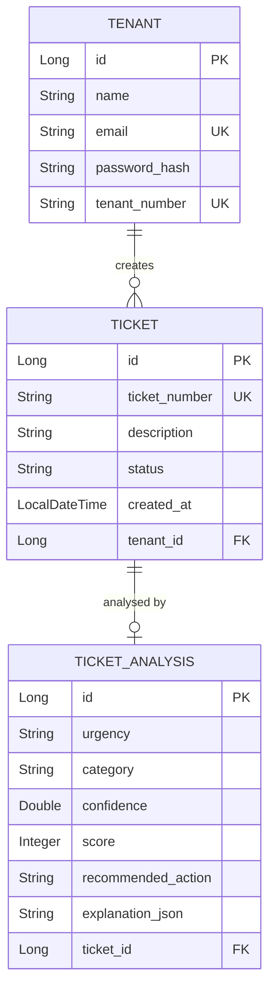

# Backend API — Nexus Core Service

> Spring Boot 3 · Java 21 · PostgreSQL · JWT Authentication

---

## Overview

The backend is the **central orchestrator** of the Nexus platform. It manages tenant authentication, ticket lifecycle, AI service integration, and will expand to include contractor management, rent dashboards, and HomeMaster ERP integration in future phases.

---

## Tech Stack

| Technology | Version | Purpose |
|-----------|---------|---------|
| Java | 21 (LTS) | Runtime |
| Spring Boot | 3.x | Web framework, DI, auto-configuration |
| Spring Data JPA | 3.x | ORM, repository pattern |
| Hibernate | 6.x | JPA implementation |
| PostgreSQL | 16 | Primary database |
| Flyway | Latest | Database migration versioning |
| Lombok | Latest | Boilerplate reduction |
| BCrypt | Spring Security | Password hashing |
| JJWT | 0.12.x | JWT generation & validation |

---

## API Endpoints

### Authentication

| Method | Endpoint | Auth | Request | Response |
|--------|----------|------|---------|----------|
| `POST` | `/auth/login` | ❌ Public | `LoginRequest` | `LoginResponse` (JWT + profile) |

### Tickets

| Method | Endpoint | Auth | Request | Response |
|--------|----------|------|---------|----------|
| `GET` | `/tickets` | ✅ JWT | — | `List<TicketResponse>` |
| `GET` | `/tickets/{id}` | ✅ JWT | — | `TicketResponse` |
| `GET` | `/tickets/tenant/{tenantId}` | ✅ JWT | — | `List<TicketResponse>` |
| `POST` | `/tickets` | ✅ JWT | `TicketRequest` | `TicketResponse` |

### Planned Endpoints (Phase 2)

| Method | Endpoint | Purpose |
|--------|----------|---------|
| `GET/POST` | `/contractors/**` | Contractor management & invoicing |
| `GET/POST` | `/staff/**` | Staff portal operations |
| `GET` | `/analytics/**` | Dashboard data |

---

## Project Structure

```
backend/
├── src/main/java/com/nexus/
│   ├── NexusApplication.java          # Spring Boot entry point
│   ├── config/
│   │   ├── SecurityConfig.java        # BCrypt password encoder bean
│   │   ├── RestConfig.java            # CORS configuration
│   │   └── DataSeeder.java            # Dev data seeding
│   ├── controller/
│   │   ├── AuthController.java        # POST /auth/login
│   │   ├── TicketController.java      # Ticket CRUD endpoints
│   │   ├── ContractorController.java  # (Phase 2)
│   │   └── StaffController.java       # (Phase 2)
│   ├── dto/
│   │   ├── auth/                      # LoginRequest, LoginResponse
│   │   ├── ticket/                    # TicketRequest, TicketResponse
│   │   └── AIResponse.java           # AI service response mapping
│   ├── mapper/
│   │   └── TicketMapper.java          # Entity → DTO transformation
│   ├── model/
│   │   ├── Tenant.java                # Tenant entity
│   │   ├── Ticket.java                # Ticket entity
│   │   └── TicketAnalysis.java        # AI analysis entity
│   ├── repository/
│   │   ├── TenantRepository.java      # JPA repository
│   │   ├── TicketRepository.java      # JPA repository
│   │   └── AnalysisRepository.java    # JPA repository
│   ├── service/
│   │   ├── AuthService.java           # Login logic
│   │   └── TicketService.java         # Ticket creation + AI integration
│   ├── integration/ai/
│   │   └── AIClient.java              # HTTP client for AI service
│   └── utility/
│       ├── JwtUtil.java               # Token generation & validation
│       └── JwtFilter.java             # Request interceptor
└── src/main/resources/
    ├── application.properties             # App config
    └── db/migration/
        └── V1__create_initial_schema.sql   # Flyway: tenants, tickets, analysis tables
```

---

## Data Model



---

## Running Locally

```bash
# Prerequisites: Java 21, PostgreSQL running on localhost:5432

# 1. Configure database
#    Edit src/main/resources/application.properties

# 2. Run (Flyway auto-applies migrations on startup)
./mvnw spring-boot:run

# API available at http://localhost:8080
# Database schema created automatically via Flyway migrations
```

### Environment Variables

| Variable | Default | Description |
|----------|---------|-------------|
| `SPRING_DATASOURCE_URL` | `jdbc:postgresql://localhost:5432/nexus` | Database URL |
| `SPRING_DATASOURCE_USERNAME` | `postgres` | DB username |
| `SPRING_DATASOURCE_PASSWORD` | `postgres` | DB password |
| `AI_SERVICE_URL` | `http://localhost:8000` | AI service base URL |
| `JWT_SECRET` | (configured) | HMAC signing key |

---

## Architecture Decisions

| Decision | Rationale |
|----------|-----------|
| **DTO mapper pattern** | Prevents circular reference issues (Ticket ↔ Analysis) and decouples API contract from JPA entities |
| **Custom JWT filter** | Lightweight alternative to Spring Security's full filter chain; extracts `tenantId` per request |
| **AI as external service** | Separate scaling, independent deployment, polyglot (Python for NLP) |
| **BCrypt cost factor 10** | Balances security with login latency for mobile clients |
| **PostgreSQL `GENERATED` columns** | Database-generated ticket numbers ensure uniqueness under concurrency |
| **Flyway migrations** | Version-controlled schema changes (`V1__create_initial_schema.sql`); auto-applied at startup, ensuring consistent database state across environments |
