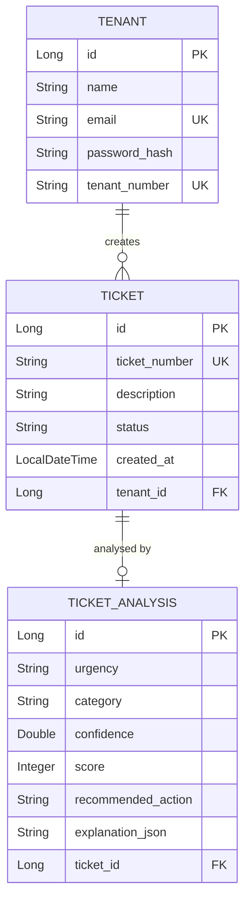

# Backend API — Nexus Core Service

> Spring Boot 3 · Java 21 · PostgreSQL · JWT Authentication

---

## Overview

The backend follows a **modular monolith** architecture — a single deployable Spring Boot application with domain-based internal structure. Two key reasons for this approach:

1. **Domain isolation** — each business capability (`auth/`, `tenant/`, `ticket/`) owns its own controllers, services, repositories, and DTOs within its package
2. **Enforced service-layer boundaries** — cross-domain access goes through service classes (e.g. `TicketService` → `TenantService`), not direct repository access

> **Future architecture:** Microservices — the modular boundaries are designed so each domain package can be extracted into an independently deployable service with minimal refactoring.

---
## Tech Stack

| Technology | Version | Purpose |
|-----------|---------|---------|
| Java | 21 (LTS) | Runtime |
| Spring Boot | 3.x | Web framework, DI, auto-configuration |
| Spring Data JPA | 3.x | ORM, repository pattern |
| Hibernate | 6.x | JPA implementation |
| PostgreSQL | 16 | Primary database |
| Flyway | Latest | Database migration versioning |
| Lombok | Latest | Boilerplate reduction |
| BCrypt | Spring Security | Password hashing |
| JJWT | 0.12.x | JWT generation & validation |

---

## API Endpoints

### Authentication

| Method | Endpoint | Auth | Request | Response |
|--------|----------|------|---------|----------|
| `POST` | `/auth/login` | ❌ Public | `LoginRequest` | `LoginResponse` (JWT + profile) |

### Tickets

| Method | Endpoint | Auth | Request | Response |
|--------|----------|------|---------|----------|
| `GET` | `/tickets` | ✅ JWT | — | `List<TicketResponse>` |
| `GET` | `/tickets/{id}` | ✅ JWT | — | `TicketResponse` |
| `GET` | `/tickets/tenant/{tenantId}` | ✅ JWT | — | `List<TicketResponse>` |
| `POST` | `/tickets` | ✅ JWT | `TicketRequest` | `TicketResponse` |

### Planned Endpoints (Phase 2)

| Method | Endpoint | Purpose |
|--------|----------|---------|
| `GET/POST` | `/contractors/**` | Contractor management & invoicing |
| `GET/POST` | `/staff/**` | Staff portal operations |
| `GET` | `/analytics/**` | Dashboard data |

---

## Project Structure

```
backend/
├── src/main/java/com/nexus/
│   ├── NexusApplication.java              # Spring Boot entry point
│   │
│   ├── auth/                              # 🔐 Auth Domain
│   │   ├── controller/AuthController.java # POST /auth/login
│   │   ├── service/AuthService.java       # Login logic + JWT issuance
│   │   ├── dto/                           # LoginRequest, LoginResponse
│   │   └── security/                      # JwtUtil, JwtFilter
│   │
│   ├── tenant/                            # 👤 Tenant Domain
│   │   ├── model/Tenant.java             # Tenant entity
│   │   ├── repository/TenantRepository.java
│   │   └── service/TenantService.java     # Tenant business logic
│   │
│   ├── ticket/                            # 🎫 Ticket Domain
│   │   ├── controller/TicketController.java # Ticket CRUD endpoints
│   │   ├── service/TicketService.java       # Ticket creation + AI integration
│   │   ├── model/                           # Ticket, TicketAnalysis entities
│   │   ├── repository/                      # TicketRepository, AnalysisRepository
│   │   ├── mapper/TicketMapper.java         # Entity → DTO transformation
│   │   └── dto/                             # TicketRequest, TicketResponse
│   │
│   ├── integration/ai/                    # 🤖 External Service Integration
│   │   ├── AIClient.java                  # HTTP client for AI service
│   │   └── AIResponse.java               # AI service response mapping
│   │
│   └── shared/                            # 🔧 Cross-cutting Concerns
│       ├── config/                        # SecurityConfig, RestConfig, DataSeeder
│       ├── controller/HomeController.java # GET / health check
│       └── exception/                     # GlobalExceptionHandler, InvalidCredentialsException
│
└── src/main/resources/
    ├── application.properties             # App config
    └── db/migration/
        └── V1__create_initial_schema.sql  # Flyway: tenants, tickets, analysis tables
```

---

## Data Model



---

## Running Locally

```bash
# Prerequisites: Java 21, PostgreSQL running on localhost:5432

# 1. Configure database
#    Edit src/main/resources/application.properties

# 2. Run (Flyway auto-applies migrations on startup)
./mvnw spring-boot:run

# API available at http://localhost:8080
# Database schema created automatically via Flyway migrations
```

### Environment Variables

| Variable | Default | Description |
|----------|---------|-------------|
| `SPRING_DATASOURCE_URL` | `jdbc:postgresql://localhost:5432/nexus` | Database URL |
| `SPRING_DATASOURCE_USERNAME` | `postgres` | DB username |
| `SPRING_DATASOURCE_PASSWORD` | `postgres` | DB password |
| `AI_SERVICE_URL` | `http://localhost:8000` | AI service base URL |
| `JWT_SECRET` | (configured) | HMAC signing key |

---

## Architecture Decisions

| Decision | Rationale |
|----------|-----------|
| **Modular Monolith** | (1) Domain isolation — each business capability has its own package with controllers, services, repos, DTOs; (2) Enforced service-layer boundaries — cross-domain access via service classes, not direct repository access. Future target: microservices extraction |
| **Service-layer boundaries** | Cross-domain access goes through service classes (e.g. `TenantService`) rather than direct repository access, enforcing domain encapsulation |
| **DTO mapper pattern** | Prevents circular reference issues (Ticket ↔ Analysis) and decouples API contract from JPA entities |
| **Custom JWT filter** | Lightweight alternative to Spring Security's full filter chain; extracts `tenantId` per request |
| **AI as external service** | Separate scaling, independent deployment, polyglot (Python for NLP) |
| **BCrypt cost factor 10** | Balances security with login latency for mobile clients |
| **PostgreSQL `GENERATED` columns** | Database-generated ticket numbers ensure uniqueness under concurrency |
| **Flyway migrations** | Version-controlled schema changes (`V1__create_initial_schema.sql`); auto-applied at startup, ensuring consistent database state across environments |

---

## 🧪 Testing Strategy

The backend relies on isolated unit testing for business logic and containerised integration testing for the data/web layer.

- **Unit Testing (JUnit 5 + Mockito):** 
  - Validates `com.nexus.*.service` classes.
  - Dependencies (Repositories, AI Client) are tightly mocked.
- **Integration Testing (Testcontainers):** 
  - Tests `com.nexus.*.repository` and `com.nexus.*.controller`.
  - Spins up an ephemeral PostgreSQL Docker container to ensure exact database parity without relying on an H2 in-memory DB.
  - Validates full HTTP request/response lifecycles, including JWT filter verification.

---

## 🚀 Future Roadmap

### 1. Planned API Endpoints

| Domain | Phase | Method | Endpoint | Purpose |
|--------|-------|--------|----------|---------|
| **Auth** | **Phase 2** | GET | `/auth/me` | Refresh/Verify current session |
| **Ticket** | **Phase 2** | PATCH | `/tickets/{id}/status` | Update Ticket Status |
| **Ticket** | **Phase 2** | PATCH | `/tickets/{id}/assign` | Assign contractor |
| **IoT** | **Phase 4** | POST | `/iot/data` | Ingest sensor data (Temp, Humidity) |
| **IoT** | **Phase 4** | GET | `/iot/property/{id}` | Get property sensor history |

### 2. Redis Caching Strategy

To improve scalability in Phase 3, **Redis** will be introduced to cache:

- **Reference Data**: `GetAllProperties`, `GetTicketCategories` (TTL: 1 hour)
- **Session Data**: Valid JWT jti (Token ID) allow-list (TTL: Token Expiry)
- **Rate Limiting**: Request counts per IP (via Bucket4j)

### 3. Microservices Extraction Plan

The current **Modular Monolith** is designed for easy extraction:

1.  **Extract AI Service**: Already separate (Python).
2.  **Extract Tenant Service**:
    - Move `com.nexus.tenant` package to new Spring Boot project.
    - Update `TicketService` to call `TenantService` via REST/gRPC instead of internal method calls.
3.  **Extract Ticket Service**:
    - Move `com.nexus.ticket` to new project.
    - Implement Event Bus (RabbitMQ/Kafka) for asynchronous updates between Ticket and Tenant services.
