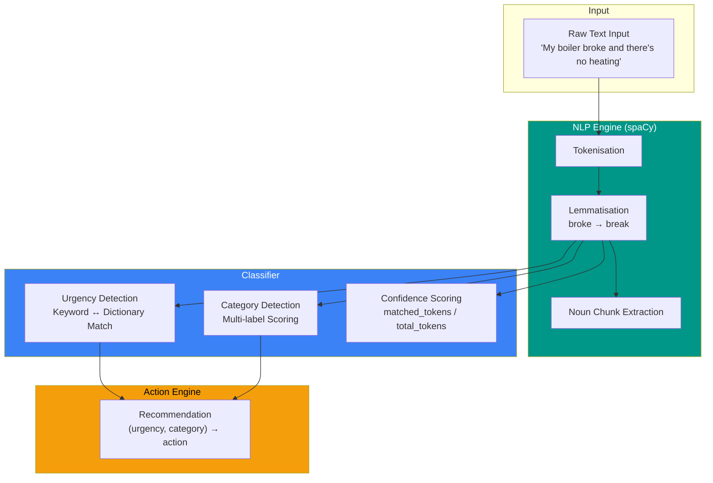
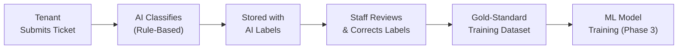
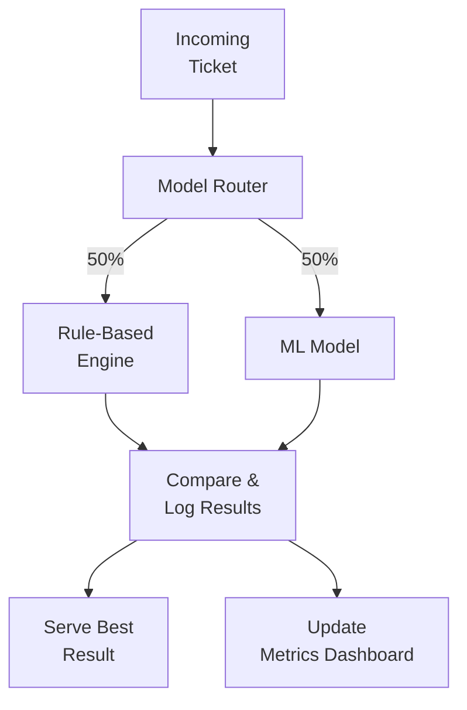
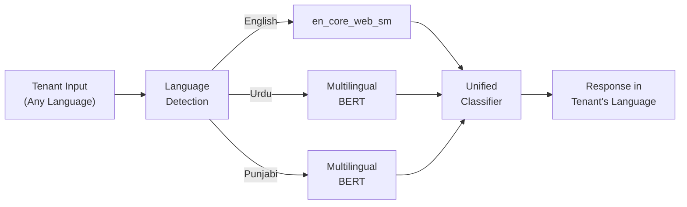
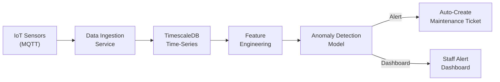

# AI/NLP Roadmap

> Evolution from Rule-Based Classification to Production ML Pipeline

---

## Current State — Rule-Based Engine (Phase 1 ✅)

The MVP uses an **explainable, deterministic** approach: keyword dictionaries + spaCy tokenisation. This was a deliberate architectural choice — rule-based systems are fully transparent, require no training data, and provide a reliable baseline against which future ML models can be benchmarked.

### Pipeline Architecture

### Current Dictionaries

| Urgency | Keywords |
|---------|----------|
| **HIGH** | leak, burst, fire, smoke, flood, gas, explode, spark |
| **MEDIUM** | mold, damp, heating, boiler, hot, water, lock, window |
| **LOW** | Default fallback |

| Category | Keywords |
|----------|----------|
| **PLUMBING** | leak, pipe, water, toilet, drain, tap |
| **ELECTRICAL** | electric, socket, spark, power, light, wire |
| **STRUCTURAL** | crack, wall, ceiling, roof, floor |
| **HEATING** | boiler, radiator, heater, thermostat |
| **GENERAL** | Default fallback |

### Strengths of Rule-Based Approach
- ✅ **Fully explainable** — every classification can trace back to exact matched keywords
- ✅ **Zero training data required** — operational from day one
- ✅ **Deterministic** — same input always produces same output
- ✅ **Easy to audit** — critical for housing compliance
- ✅ **Maintains a baseline** — future ML models must outperform this to be deployed

### Known Limitations
- ❌ Cannot handle synonyms not in the dictionary (e.g., "faucet" vs "tap")
- ❌ No contextual understanding (e.g., "water is cold" → HEATING, not PLUMBING)
- ❌ Single-language only (English)
- ❌ Confidence score is simplistic (token ratio, not true probability)

---

## Phase 2 — Enhanced Rule Engine (Months 7–11)

**Goal:** Expand coverage without moving to ML yet — accumulate labelled training data.

| Enhancement | Description |
|------------|-------------|
| **Synonym expansion** | WordNet integration for automatic synonym discovery |
| **Negation handling** | Detect "no heating" vs "heating is fine" |
| **Multi-word matching** | Phrase-level patterns (e.g., "water heater", "circuit breaker") |
| **Data labelling pipeline** | Staff-verified ticket labels feed future training |
| **Expanded categories** | Add PEST_CONTROL, SECURITY, COMMUNAL_AREAS |

### Data Collection Strategy

> Every ticket processed during Phase 1–2 becomes labelled training data for Phase 3. Staff corrections create a gold-standard dataset with human-validated ground truth.

---

## Phase 3 — Machine Learning Models (Months 12–16)

**Goal:** Train supervised classifiers on accumulated labelled data, deploy alongside rule-based system.

### Model Selection Strategy

| Model | Use Case | Rationale |
|-------|---------|-----------|
| **TF-IDF + Logistic Regression** | Urgency & category baseline | Fast, interpretable, small data-friendly |
| **DistilBERT** | Advanced text classification | Contextual understanding, handles nuance |
| **Multilingual BERT** | Multi-lingual support | Urdu, Punjabi, Bengali for NUCHA demographics |

### A/B Testing Architecture

**Acceptance criteria for ML deployment:**
- Accuracy ≥ 90% on held-out test set
- F1-score per class ≥ 0.85
- Latency ≤ 200ms (p95)
- Must outperform rule-based engine on the same test set

### Multi-Lingual NLP

---

## Phase 4 — Predictive Intelligence (Months 17–22)

**Goal:** Move from reactive (tenant reports issue) to proactive (system predicts issues before they occur).

### IoT-Driven Predictive Maintenance

| Sensor | Data Point | Prediction |
|--------|-----------|------------|
| **Temperature** | Room temp over time | Heating system failure |
| **Humidity** | Moisture levels | Mould risk before visible |
| **Gas** | CO / methane levels | Leak detection |
| **Water flow** | Usage patterns | Pipe burst / leak risk |

### ML Pipeline for Sensor Data

---

## Success KPIs

| Metric | Phase 1 Target | Phase 3 Target | Phase 4 Target |
|--------|---------------|----------------|----------------|
| **Classification accuracy** | ≥ 75% (rule-based) | ≥ 90% (ML) | ≥ 95% (ML + IoT) |
| **Response latency** | < 500ms | < 200ms | < 200ms |
| **Languages supported** | 1 (English) | 4+ | 4+ |
| **False positive rate** | < 20% | < 10% | < 5% |
| **Predictive lead time** | N/A | N/A | 24-72 hours |
