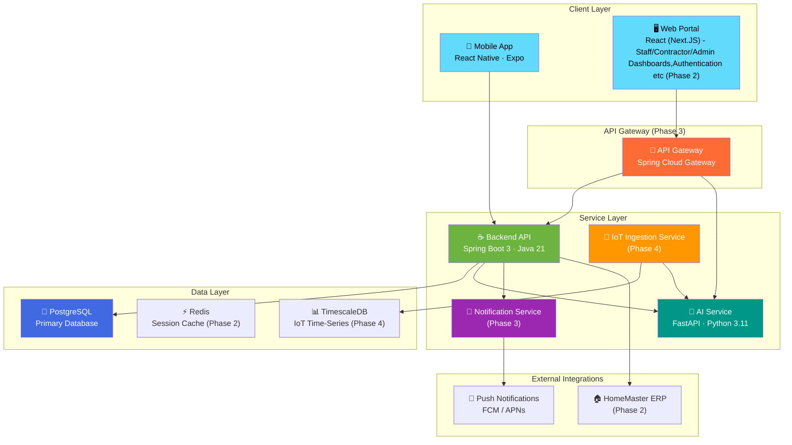
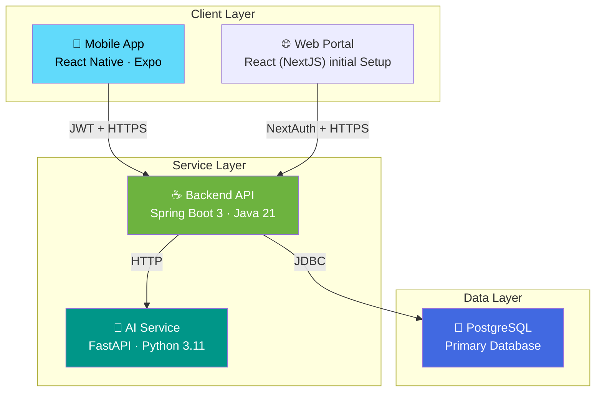
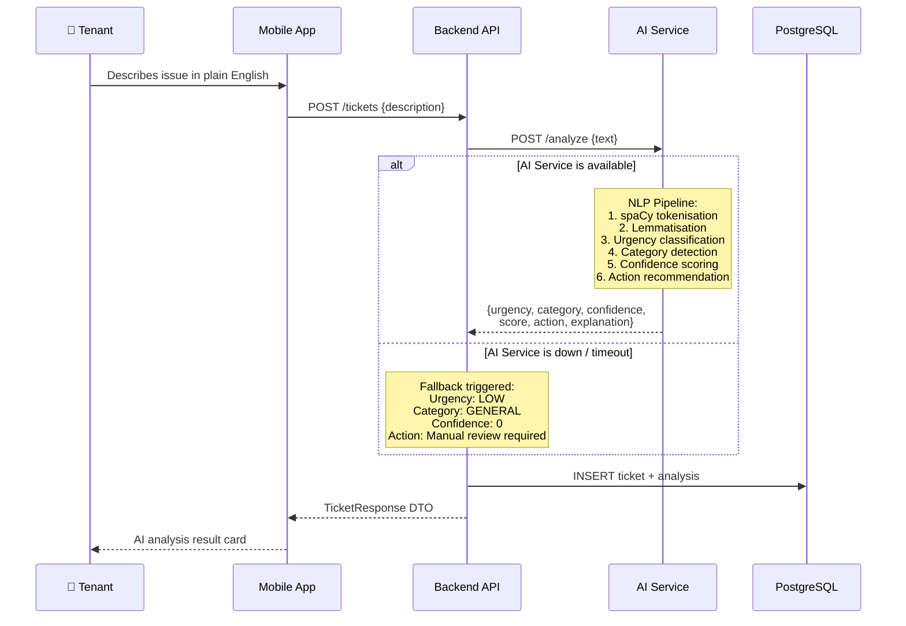
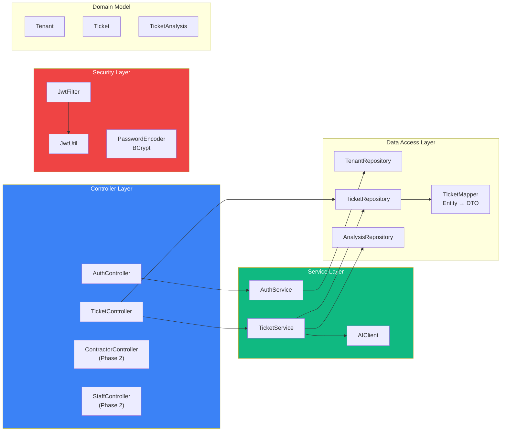
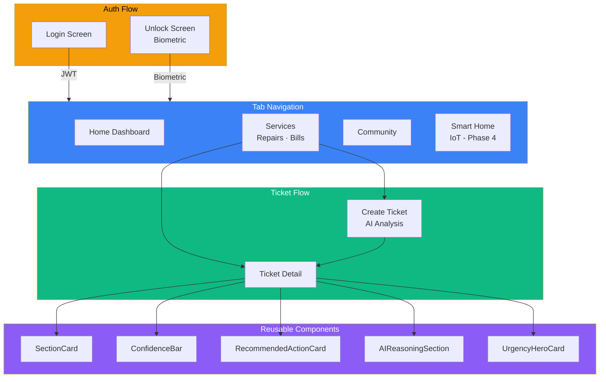
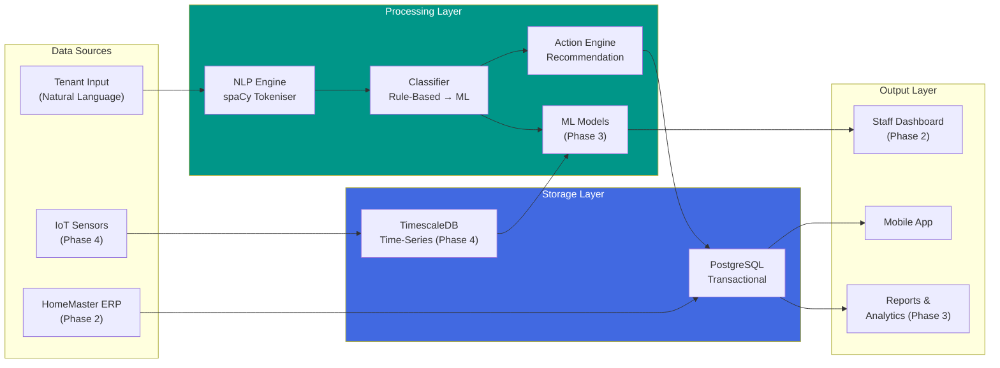

# System Architecture

> Nexus Platform — Microservices Architecture & Component Design

---

## Future Architecture (Target State)

Nexus follows a **microservices architecture** with three independently deployable services communicating over REST APIs, fronted by a cross-platform mobile client.

---

## Current MVP Architecture

The MVP consists of the core active services: the mobile client, backend API, AI classification service, and the primary database.

---

## MVP System Flow (Interaction Diagram)

The MVP implements the core interaction loop: **Tenant → Mobile App → Backend → AI → Response**.

---

## Service Communication Matrix

| Source | Target | Protocol | Auth | Purpose |
|--------|--------|----------|------|---------|
| Mobile App | Backend | HTTPS/REST | JWT Bearer | All client operations |
| Backend | AI Service | HTTP/REST | Internal (network) | Ticket text analysis |
| Backend | PostgreSQL | JDBC | Credentials | Data persistence |
| Web Portal | Backend | HTTPS/REST | JWT Bearer | Staff operations (Phase 2) |
| IoT Sensors | IoT Service | MQTT/HTTPS | API Key (Phase 4) | Sensor data ingestion |

---

## Backend Component Architecture

---

## Mobile App Screen Architecture

---

## Data Flow Architecture

---

## Technology Decisions

| Decision | Choice | Rationale |
|----------|--------|-----------|
| **Mobile framework** | React Native (Expo) | Cross-platform iOS/Android from single codebase; strong ecosystem |
| **Backend** | Spring Boot 3 + Java 21 | Enterprise-grade, JPA/Hibernate ORM, mature security tooling |
| **AI service** | FastAPI + Python | Best ecosystem for NLP (spaCy), async-ready, separate scaling |
| **Database** | PostgreSQL | ACID compliance for financial data (rent), JSON support for analysis |
| **Auth** | JWT + BCrypt | Stateless for mobile clients, industry-standard password hashing |
| **AI approach** | Rule-based → ML | Start with explainable rules, evolve to ML as training data accumulates |
| **Architecture** | Microservices | Independent scaling, polyglot (Java + Python), isolated failure domains |
| **DB Migrations** | Flyway | Version-controlled schema evolution; auto-applied at startup for consistent environments |
