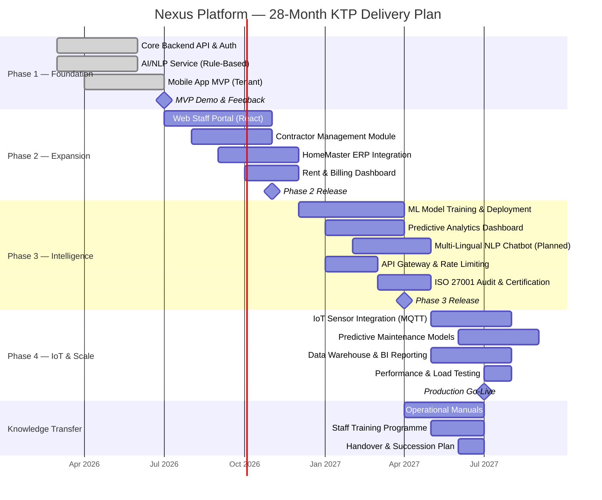
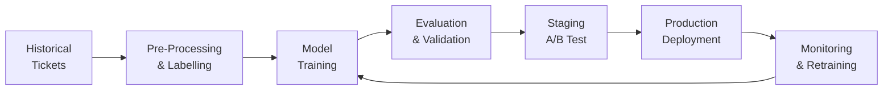
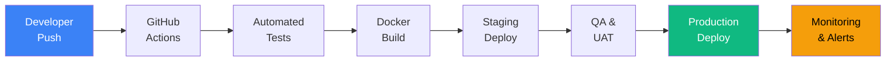

# Deployment Strategy

> 28-Month Phased Rollout — From MVP to Production-Ready Housing Platform

---

## Programme Timeline



---

## Phase Breakdown

### Phase 1 — Foundation (Months 1–6) ✅ MVP

**Goal:** Prove the core concept — AI-powered tenant issue reporting via mobile.

| Deliverable | Technology | Status |
|------------|-----------|--------|
| Tenant authentication (login, biometric) | Spring Boot + JWT + Expo | ✅ Complete |
| AI/NLP ticket classification | FastAPI + spaCy (rule-based) | ✅ Complete |
| Mobile app (create, view, track tickets) | React Native + Expo Router | ✅ Complete |
| Reusable component library | NativeWind + custom components | ✅ Complete |
| REST API with DTO mapper pattern | Spring Boot + JPA + PostgreSQL | ✅ Complete |

**Infrastructure:**
```
Local Development
├── Backend:    localhost:8080  (Spring Boot)
├── AI Service: localhost:8000  (Uvicorn)
├── Database:   localhost:5432  (PostgreSQL)
└── Mobile:     Expo Dev Client (LAN)
```

---

### Phase 2 — Expansion (Months 7–11)

**Goal:** Add staff-facing tools and integrate with existing housing systems.

| Deliverable | Technology | Details |
|------------|-----------|---------|
| **Web Staff Portal** | React.js + TypeScript | Ticket queue, assignment, SLA tracking |
| **Contractor Management** | Spring Boot module | Invoice upload, approval workflow, reconciliation |
| **HomeMaster Integration** | REST/SOAP adapter | Bi-directional sync of tenant and property data |
| **Rent & Billing Dashboard** | React.js + Chart.js | Arrears tracking, payment history, alerts |
| **Redis Session Cache** | Redis 7 | JWT blacklist, rate limiting, session management |

**Infrastructure:**
```
Staging Environment (Azure / AWS)
├── App Service:      Backend API
├── App Service:      AI Service
├── App Service:      Web Portal (Static)
├── Azure Database:   PostgreSQL Flexible Server
├── Azure Cache:      Redis
├── Azure CDN:        Static assets
└── Azure Monitor:    Logging & alerting
```

---

### Phase 3 — Intelligence (Months 12–16)

**Goal:** Evolve from rule-based to ML-driven intelligence.

| Deliverable | Technology | Details |
|------------|-----------|---------|
| **ML Ticket Classifier** | scikit-learn → transformers | Trained on accumulated ticket data |
| **Predictive Analytics** | Python + pandas + matplotlib | Trend analysis, seasonal patterns |
| **Multi-Lingual NLP** | spaCy + multilingual models | Support for Urdu, Punjabi, Bengali |
| **API Gateway** | Spring Cloud Gateway | Centralised routing, rate limiting, auth |
| **ISO 27001 Certification** | Security audit | Formal Secure by Design compliance |

**ML Pipeline:**


---

### Phase 4 — IoT & Scale (Months 17–22)

**Goal:** Add predictive maintenance via IoT sensors and prepare for production scale.

| Deliverable | Technology | Details |
|------------|-----------|---------|
| **IoT Sensor Integration** | MQTT + Azure IoT Hub | Temperature, humidity, gas leak detection |
| **Predictive Maintenance** | TensorFlow / PyTorch | Anomaly detection on sensor time-series |
| **Data Warehouse** | TimescaleDB + dbt | Historical analytics and BI reporting |
| **Load Testing** | k6 / Gatling | Target: 10,000 concurrent tenants |

**Production Architecture:**
```
Production (Azure Cloud)
├── AKS Cluster (Kubernetes)
│   ├── Backend API    ×3 replicas
│   ├── AI Service     ×2 replicas
│   ├── Web Portal     ×2 replicas
│   ├── IoT Ingestion  ×2 replicas
│   └── API Gateway    ×2 replicas
├── Azure Database for PostgreSQL (HA)
├── Azure Cache for Redis (Clustered)
├── TimescaleDB (IoT time-series)
├── Azure IoT Hub (Device management)
├── Azure Monitor + Log Analytics
├── Azure Key Vault (Secrets)
└── Azure CDN (Static assets)
```

---

### Knowledge Transfer (Months 22–28)

**Goal:** Embed knowledge within NUCHA to sustain innovation post-KTP.

| Deliverable | Description |
|------------|-------------|
| **Operational Manuals** | System admin guides, deployment runbooks, troubleshooting guides |
| **Training Programme** | Hands-on workshops for NUCHA IT staff on maintenance and operations |
| **Architecture Documentation** | Full ADRs, API specs (OpenAPI/Swagger), data dictionary |
| **Succession Plan** | Identified internal champions, ongoing support structure |
| **Academic Outputs** | Research publications on AI in social housing, conference presentations |

---

## Deployment Pipeline (CI/CD)



**Pipeline stages:**

| Stage | Tools | Trigger |
|-------|-------|---------|
| **Lint & Test** | JUnit, pytest, Jest | Every push |
| **Build** | Maven (Java), pip (Python), npm (React) | On merge to `main` |
| **Containerise** | Docker + Docker Compose | Post-build |
| **Deploy Staging** | Azure App Service / AKS | Auto on `main` |
| **Deploy Production** | AKS with blue-green | Manual approval |
| **Monitor** | Azure Monitor, Sentry | Continuous |

---

## Environment Strategy

| Environment | Purpose | Database | AI Model |
|------------|---------|----------|----------|
| **Local** | Development | PostgreSQL (local) | Rule-based |
| **Staging** | QA, UAT, demos | Azure PostgreSQL | Latest model |
| **Production** | Live tenants | Azure PostgreSQL (HA) | Validated model |
