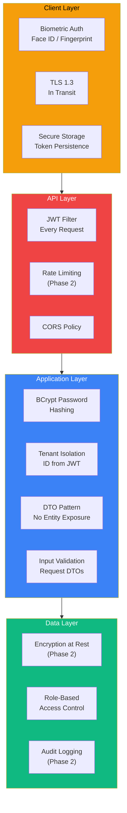
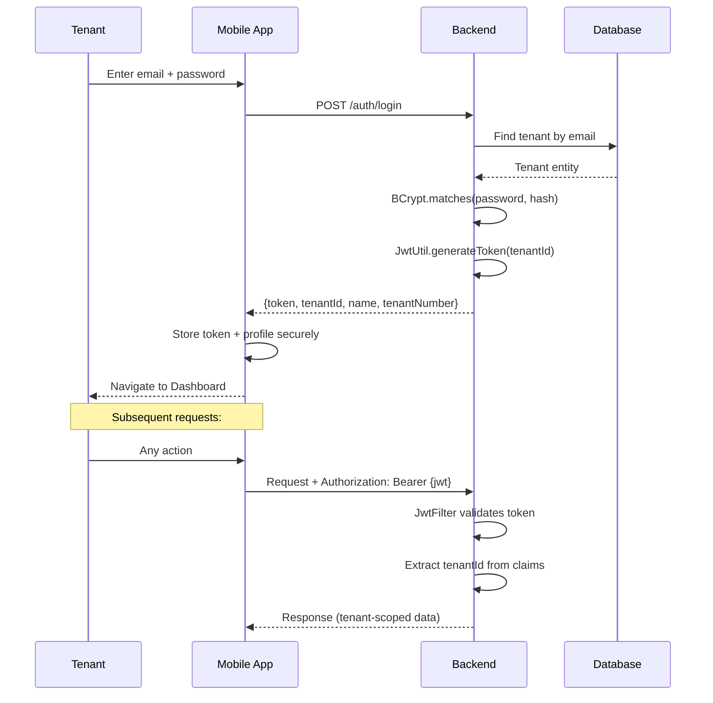

# Security Framework

> Secure by Design — Aligned with ISO 27001 Principles

---

## Overview

Nexus implements a defence-in-depth security architecture from day one, designed to evolve toward full **ISO 27001 certification** during Phase 3. Security is not bolted on — it is embedded at every layer of the architecture.

---

## Security Architecture

---

## Implemented Controls (Phase 1)

### Authentication

| Control | Implementation | Details |
|---------|---------------|---------|
| **Password hashing** | BCrypt (Spring Security) | Salt automatically generated, cost factor 10 |
| **Token-based auth** | JWT (HMAC-SHA256) | Stateless, configurable expiry |
| **Biometric unlock** | `expo-local-authentication` | Device-level Face ID / Touch ID |
| **Session management** | Secure local storage | Token persisted, cleared on sign-out |
| **Auto-lock** | AppState listener | Locks on background, requires biometric to resume |

### Authentication Flow

### API Security

| Control | Implementation |
|---------|---------------|
| **Request filtering** | Custom `JwtFilter` intercepts all protected routes |
| **Tenant isolation** | `tenantId` extracted from JWT, injected via `request.setAttribute()` |
| **DTO pattern** | Entities never exposed directly — `TicketMapper` transforms to DTOs |
| **CORS** | Configured via `RestConfig` with explicit origin control |
| **Input validation** | Request DTOs with type constraints |

---

## Planned Controls (Phase 2–3)

### Phase 2

| Control | Implementation | ISO 27001 Ref |
|---------|---------------|--------------|
| **HTTPS everywhere** | TLS 1.3 via Azure App Service | A.10.1 |
| **Rate limiting** | Spring Cloud Gateway / Bucket4j | A.14.1 |
| **JWT blacklist** | Redis-backed token revocation | A.9.4 |
| **Audit logging** | Every create/update/delete logged with actor | A.12.4 |
| **Role-based access** | TENANT, STAFF, ADMIN, CONTRACTOR roles | A.9.1 |
| **Encryption at rest** | Azure Database TDE | A.10.1 |
| **Secret management** | Azure Key Vault for credentials | A.10.1 |

### Phase 3 — ISO 27001 Certification

| Domain | Controls |
|--------|---------|
| **A.5 Information Security Policies** | Documented security policy, review cycle |
| **A.6 Organisation of Security** | Responsibility matrix, segregation of duties |
| **A.8 Asset Management** | Data classification (PII, financial, operational) |
| **A.9 Access Control** | RBAC, least privilege, access reviews |
| **A.10 Cryptography** | TLS in transit, AES-256 at rest, key rotation |
| **A.12 Operations Security** | Logging, monitoring, vulnerability scanning |
| **A.14 System Acquisition** | Secure SDLC, code review, dependency scanning |
| **A.18 Compliance** | GDPR data subject rights, Data Protection Act 2018 |

---

## Data Protection (GDPR / DPA 2018)

| Principle | Implementation |
|-----------|---------------|
| **Lawful basis** | Legitimate interest (housing management) + consent |
| **Data minimisation** | Only essential tenant data collected |
| **Purpose limitation** | Data used solely for housing services |
| **Storage limitation** | Retention policies defined per data type |
| **Right to erasure** | Account deletion API endpoint (Phase 2) |
| **Right of access** | Data export API endpoint (Phase 2) |
| **Breach notification** | Incident response plan + 72-hour ICO notification procedure |

---

## Threat Model

| Threat | Mitigation | Status |
|--------|-----------|--------|
| **Brute force login** | BCrypt slow hashing + rate limiting (Phase 2) | 🟡 Partial |
| **JWT theft** | Short expiry + biometric re-auth + HTTPS | ✅ |
| **SQL injection** | JPA parameterised queries (no raw SQL) | ✅ |
| **XSS** | React Native (no HTML rendering) + DTO validation | ✅ |
| **Circular ref data leak** | DTO mapper pattern, no raw entity exposure | ✅ |
| **Insecure direct object ref** | Tenant ownership validation on ticket access | 🟡 Planned |
| **Dependency vulnerabilities** | Dependabot + npm audit (Phase 2) | 🔜 |
| **Insider threat** | RBAC + audit logging (Phase 2) | 🔜 |
