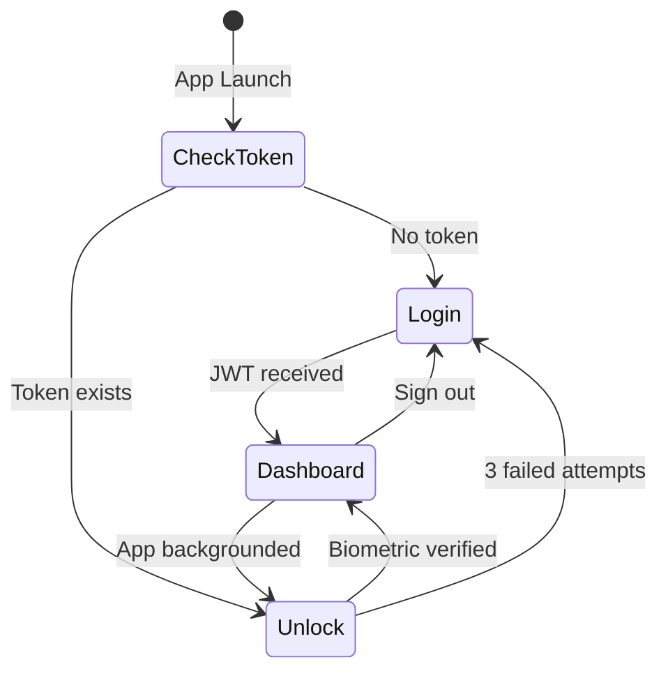

# Mobile App — Nexus Tenant Experience

> React Native · Expo SDK 52 · NativeWind · Expo Router

---

## Overview

The Nexus mobile app is the **primary tenant interface** — a cross-platform iOS/Android application that provides secure login, AI-powered issue reporting, real-time ticket tracking, and a foundation for future features including IoT monitoring and a multi-lingual NLP chatbot (Phase 3).

---

## Tech Stack

| Technology | Version | Purpose |
|-----------|---------|---------|
| React Native | 0.76+ | Cross-platform mobile framework |
| Expo | SDK 52 | Managed workflow, dev tooling |
| Expo Router | 4.x | File-based routing (tabs + stacks) |
| NativeWind | 4.x | Tailwind CSS for React Native |
| TypeScript | 5.x | Type safety |
| Axios | 1.x | HTTP client with interceptors |
| expo-linear-gradient | Latest | Gradient cards and hero sections |
| expo-local-authentication | Latest | Biometric auth (Face ID / Fingerprint) |
| react-native-safe-area-context | Latest | Safe area handling |

---

## Screens

| Screen | Route | Description |
|--------|-------|-------------|
| **Login** | `(auth)/login` | Email + password authentication |
| **Unlock** | `(auth)/unlock` | Biometric re-authentication after lock |
| **Home** | `(tabs)/index` | Dashboard with quick actions and stats |
| **Services** | `(tabs)/services` | Segmented view: Repairs (tickets) + Bills |
| **Community** | `(tabs)/community` | Community board (placeholder) |
| **Smart Home** | `(tabs)/smart-home` | IoT monitoring (Phase 4 placeholder) |
| **Profile** | `profile` | Tenant info, settings, sign out |
| **Create Ticket** | `ticket/create` | AI-powered issue reporting form |
| **Ticket Detail** | `ticket/[id]` | Full ticket view with AI analysis |

---

## Component Architecture

### Reusable Ticket Components (`components/ticket/`)

| Component | Props | Description |
|-----------|-------|-------------|
| `SectionCard` | `icon`, `title`, `children` | Titled card wrapper with icon header |
| `ConfidenceBar` | `confidence` (0–1) | Progress bar with dynamic colour + label |
| `RecommendedActionCard` | `action` | Blue gradient card with lightning icon |
| `AIReasoningSection` | `explanationJson`, `showStepCount?` | Collapsible accordion, self-managed state |
| `UrgencyHeroCard` | `urgency`, `category`, `createdAt`, `score?` | Gradient hero with priority and metadata |

### UI Components (`components/ui/`)

| Component | Description |
|-----------|-------------|
| `TabBar` | Custom animated bottom tab bar |
| `TabBarButton` | Individual tab button with animation |
| `NexusSplash` | Branded splash / loading screen |
| `SlidingDot` | Animated dot indicator |

### Service Components (`components/services/`)

| Component | Description |
|-----------|-------------|
| `TicketsView` | Live ticket list with pull-to-refresh, Active/Closed sections |

---

## Project Structure

```
mobile-app/
├── app/                              # File-based routing (Expo Router)
│   ├── _layout.tsx                   # Root layout (Stack navigator)
│   ├── globals.css                   # Global Tailwind styles
│   ├── (auth)/
│   │   ├── _layout.tsx               # Auth stack layout
│   │   ├── login.tsx                 # Login screen
│   │   └── unlock.tsx                # Biometric unlock screen
│   ├── (tabs)/
│   │   ├── _layout.tsx               # Tab navigator layout
│   │   ├── index.tsx                 # Home dashboard
│   │   ├── services.tsx              # Repairs + Bills (segmented)
│   │   ├── community.tsx             # Community board
│   │   └── smart-home.tsx            # IoT monitoring (Phase 4)
│   ├── ticket/
│   │   ├── create.tsx                # AI-powered ticket creation
│   │   └── [id].tsx                  # Ticket detail screen
│   └── profile.tsx                   # Tenant profile screen
├── components/
│   ├── ticket/                       # Reusable ticket UI components
│   ├── services/                     # TicketsView (live data list)
│   └── ui/                           # TabBar, splash, alerts
├── context/
│   └── AuthContext.tsx                # Auth state, biometric, session
├── services/
│   ├── api.ts                        # Axios instance + JWT interceptor
│   ├── auth.service.ts               # Login API call
│   └── ticket.service.ts             # Ticket CRUD API calls
├── types/
│   ├── context-type.ts               # Auth context types
│   └── ticket-type.ts                # Ticket & config interfaces
└── utils/
    └── helpers.ts                    # Shared helpers (urgency, category, date)
```

---

## Authentication Flow



**Security features:**
- JWT token stored in secure local storage
- Biometric unlock (Face ID / Fingerprint) via `expo-local-authentication`
- Auto-lock on app background with `AppState` listener
- Token attached to all API calls via Axios interceptor

---

## Running Locally

```bash
# Prerequisites: Node.js 18+, Expo Go on physical device

# 1. Install dependencies
npm install

# 2. Start dev server
npx expo start

# 3. Scan QR code with Expo Go
#    Or press 'a' for Android emulator / 'i' for iOS simulator
```

### Required Services

The app requires both the backend and AI service to be running:

| Service | URL | Required For |
|---------|-----|-------------|
| Backend API | `http://<your-ip>:8080` | All operations |
| AI Service | `http://<your-ip>:8000` | Ticket analysis (via backend) |

---

## Design System

### Colour Palette

| Token | Hex | Usage |
|-------|-----|-------|
| Primary | `#3b82f6` | Buttons, links, active states |
| Success | `#10b981` | Confirmed, low urgency |
| Warning | `#f59e0b` | Medium urgency, caution |
| Danger | `#ef4444` | High urgency, errors |
| Surface | `#f8fafc` | Background |
| Card | `#ffffff` | Card backgrounds |
| Text | `#0f172a` | Primary text |
| Muted | `#94a3b8` | Secondary text, labels |

### Typography
- **Font:** System default (SF Pro on iOS, Roboto on Android)
- **Scale:** 10px (micro labels) → 24px (headers)
- **Weight:** Regular, Semibold, Bold

---

## 🧪 Testing Strategy

- **Frameworks:** Jest + React Native Testing Library (RNTL)
- **Unit Testing:** Helper functions (like urgency colour mapping and date formatting) and state reducers.
- **Component Testing:** Rendering views with mock data, simulating user interactions (e.g. pressing the biometric unlock button), and asserting UI state changes.
- **Context Mocking:** Auth contexts are mocked to test protected route redirects independently of the actual backend.
- **E2E Testing (Phase 3):** Detox will be used to run automated UI tests on actual iOS Simulator / Android Emulator builds.

---

## 🔮 Future Roadmap

| Phase | Feature | Description |
|-------|---------|-------------|
| **Phase 2 (Next)** | **Rent & Bills** | Payment history, arrears view, PDF downloads |
| **Phase 3** | **Multi-Lingual** | In-app language switching (English/Spanish/Polish) |
| **Phase 4** | **IoT Smart Home** | Real-time sensor monitoring (Temp/Humidity) |

### 🔌 Planned Mobile Endpoints

| Domain | Method | Endpoint | Purpose |
|--------|--------|----------|---------|
| **IoT** | GET | `/iot/property/{id}` | View home sensor data (Phase 4) |
| **Auth** | POST | `/auth/refresh` | Silent token refresh |
| **Comms** | POST | `/messages` | Chat with Staff/AI (Phase 3) |
